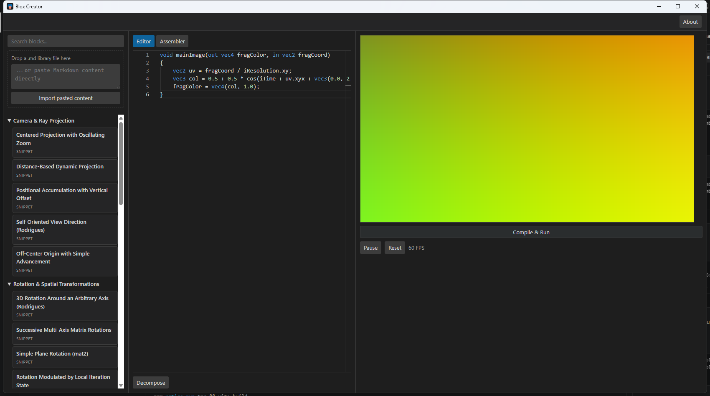

# Blox Creator

Offline desktop application to manage and assemble reusable GLSL code blocks into complete, Shadertoy-compatible shaders.

## Status

Early development (`v0.1.0-dev`). Phase 0 — project initialization and tooling.

## Features (planned)

- Import a structured Markdown library of GLSL blocks into a local SQLite database.
- Automatically decompose a shader pasted into Monaco Editor into reusable blocks.
- Deduplicate blocks via SHA-256 hashing of normalized code.
- Visually reorder and assemble selected blocks into a complete Shadertoy shader.
- Real-time WebGL2 preview (800×450) with standard Shadertoy uniforms.

## Screenshot

## Installation

See [`docs/COMPILATION.md`](docs/COMPILATION.md) for build instructions.

## License

MIT — see [`LICENSE`](LICENSE).

## Author

Patrick JAILLET
E-mail: sandefjord.development@proton.me
Website: https://patrickjaillet.github.io/sandefjord-software
